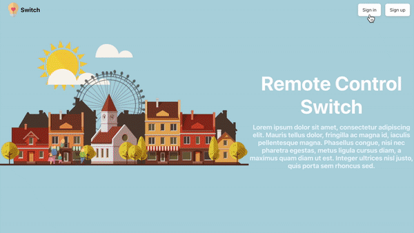
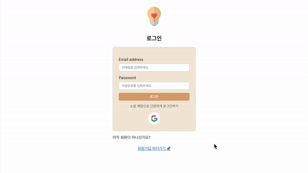
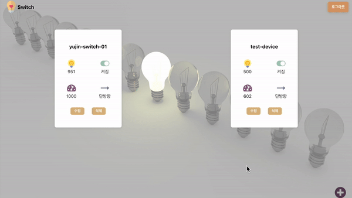
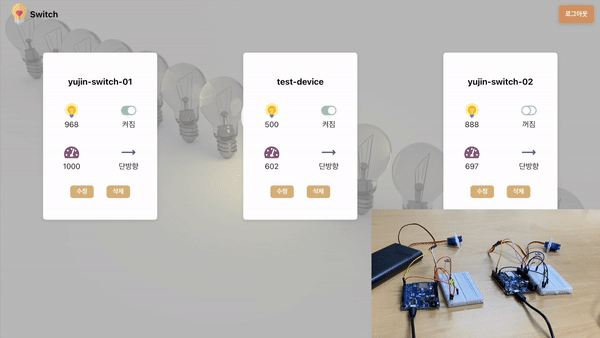
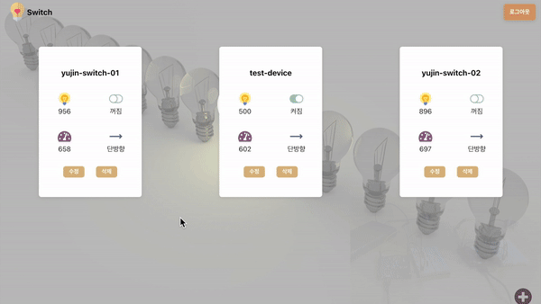
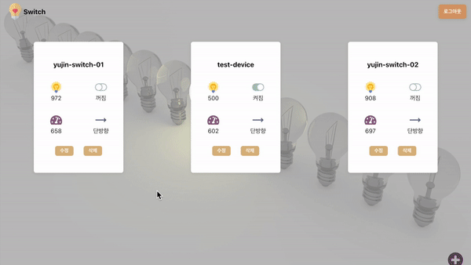

# Remote Control Switch (원격 제어 스위치)

> 아두이노를 웹페이지에서 제어하기
> 
> 현재 밝기값 & 사용자가 설정하는 기준값으로 서보모터를 제어하여 스위치 상태 변환하기

## 메인화면

---

## 로그인화면

### 구글아이디로 로그인

---

## 기기추가

아두이노보드에 전원을 연결한 후 ID를 등록한 기기만 추가가 가능합니다. 

---

## 기준값수정

현재 밝기값이 사용자가 설정한 기준값(658) 보다 밝으므로, 서보모터를 제어하여 스위치를 off 합니다.

현재 스위치 상태를 나타내기 위해 LED를 사용하였습니다.

---

## 밝기에따른제어

주변이 어두워지면 현재 밝기값이 기준값보다 작아지게 되므로, 서보모터를 제어하여 스위치를 on 합니다.

반대로, 주변이 밝아지면 현재 밝기값이 기준값보다 커지게 되므로, 서보모터를 제어하여 스위치를 off 합니다. 

---

## 기준값에 관계없이 제어하기

주변의 밝기와 상관없이 사용자가 스위치를 on/off 하고 싶은 경우, 수정화면에서 기준값을 0으로 설정하면 스위치가 off, 1000으로 설정하면 스위치가 on 됩니다.

---

## 반응형

    

